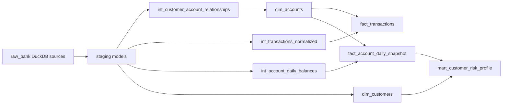
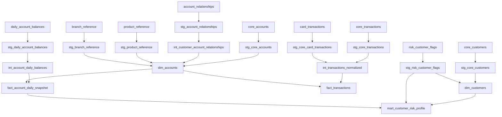

# Southern Cross Bank Demo Pipeline Design

## Problem Statement

Retail banking analytics needs a governed DuckDB/dbt pipeline for a fictional Australian bank. The pipeline must produce safe customer and account dimensions, normalized transaction facts, daily balance snapshots, and customer risk profile reporting flags while keeping direct PII out of marts.

## Source And Target Summary

Confirmed source context:

- DuckDB database: `data/bank_demo.duckdb`
- Raw schema: `raw_bank`
- Source tables: `core_customers`, `core_accounts`, `account_relationships`, `core_transactions`, `card_transactions`, `daily_account_balances`, `risk_customer_flags`, `branch_reference`, and `product_reference`
- Reporting timezone: `Australia/Sydney`
- Source timestamp convention: UTC timestamps except `daily_account_balances.balance_date`, which is already a local business date

Target grain:

- `dim_customers`: one row per current source customer
- `dim_accounts`: one row per current source account
- `fact_transactions`: one row per included posted transaction or pending card authorization
- `fact_account_daily_snapshot`: one row per account per snapshot date
- `mart_customer_risk_profile`: one row per customer per snapshot date

## DBT Model Structure

Staging models perform type casting, code standardization, UTC to `Australia/Sydney` timestamp conversion, light cleanup, and PII minimization where possible.

Intermediate models apply reusable business logic:

- `int_customer_account_relationships` resolves all customer-account relationships with account and customer context.
- `int_transactions_normalized` unions core and card transactions into one signed transaction structure.
- `int_account_daily_balances` combines official balance snapshots with posted transaction activity and overdraft indicators.

Mart models expose business-facing datasets:

- `dim_customers` excludes names, email addresses, phone numbers, and raw date of birth.
- `dim_accounts` excludes BSB and unmasked account numbers.
- `fact_transactions` preserves prefixed transaction ids for audit traceability.
- `fact_account_daily_snapshot` supports balance, liquidity, overdraft, and activity reporting.
- `mart_customer_risk_profile` exposes risk and care concepts as booleans only.

## Transformation Flow

1. Read raw DuckDB sources from `raw_bank`.
2. Stage each source table with stable naming, types, accepted value cleanup, and local timestamp conversion.
3. Resolve account ownership and authority using `account_relationships` rather than relying only on the primary account owner.
4. Normalize core and card transactions into one model with source-system indicators, prefixed ids, local posting dates, signed amounts, normalized categories, merchant fields, pending flags, and fraud suspicion flags.
5. Join daily balance snapshots with posted transaction activity for each account and date.
6. Build marts with privacy-safe customer attributes, current account attributes, transaction facts, daily balance snapshots, and date-effective customer risk profile flags.

## Lineage

## Key Business Rules

- Direct PII fields from customer sources are not exposed in marts.
- Customer age is exposed only as an `age_band`.
- Source transaction identifiers are preserved and prefixed in normalized transaction models to prevent collisions.
- Core banking transaction amounts are signed using transaction type, reversal indicator, and debit/credit indicator.
- Card transactions use clearing timestamp and settlement amount when present; authorization timestamp and authorization amount are used for pending card authorizations.
- Only posted transactions and pending card authorizations are exposed in `fact_transactions`.
- Daily balances are the source of truth for ledger and available balances.
- Null arrears days become zero only for open accounts.
- Risk and customer care flags are exposed as booleans only; source case ids stay out of marts.
- Reporting timestamps are converted from UTC to `Australia/Sydney`.

## Data Quality And Tests

Schema tests cover:

- Not-null and uniqueness for source and model primary keys.
- Accepted values for customer type, customer status, account type, account status, transaction type, transaction status, relationship type, flag type, and flag status.
- Referential integrity from accounts to customers, transactions to accounts, balances to accounts, and risk flags to customers.

Singular tests cover:

- `stg_core_transactions.amount` must be non-null and non-negative before signing.
- `fact_transactions.transaction_status` must be `POSTED` unless `is_pending` is true.
- `fact_account_daily_snapshot` must be unique by `account_id`, `snapshot_date`.
- `mart_customer_risk_profile` must be unique by `customer_id`, `snapshot_date`.

Freshness expectations are documented in `models/sources.yml`. Command validation requires `dbt-duckdb`, which was not installed in this local environment during generation.

## Operational Notes

- Package profile: `southern_cross_bank_demo`
- DuckDB path default: `../data/bank_demo.duckdb`, overridable with `DUCKDB_PATH`
- Local validation command: `dbt build --profiles-dir southern_cross_bank_demo_pipeline`
- Local dbt documentation command: `dbt docs generate --profiles-dir southern_cross_bank_demo_pipeline`
- GitHub Pages documentation command: `python scripts/build_static_docs.py . site`
- Included workflow: `.github/workflows/publish-dbt-docs.yml` inside the output package. If the package is kept nested, copy that workflow to the consuming repository root `.github/workflows/` or adapt the paths.

## Assumptions, Risks, And Open Questions

- Assumption: DuckDB is the target warehouse because the source information is a table in DuckDB and the acceptance criteria require a DuckDB demo.
- Assumption: `mart_customer_risk_profile` snapshot dates align to available account balance snapshot dates.
- Assumption: Pending card authorizations are retained in `fact_transactions` because the requirements specify pending handling; declined and failed events are excluded.
- Risk: `current_date` makes age bands and current active flags date-sensitive. For reproducible historical runs, parameterize the reporting date.
- Risk: Full dbt validation still needs a private profile and a local or CI-generated DuckDB file.
- Open question: Whether a later consuming docs site should replace the static GitHub Pages demo with Docusaurus and Mermaid rendering.
