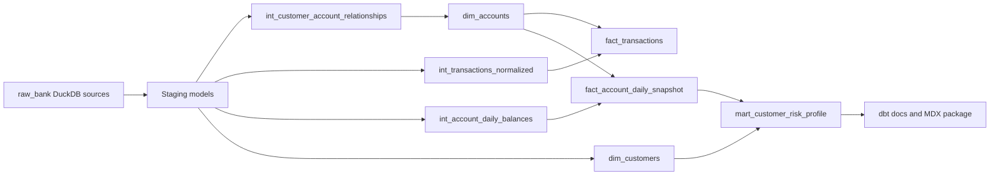
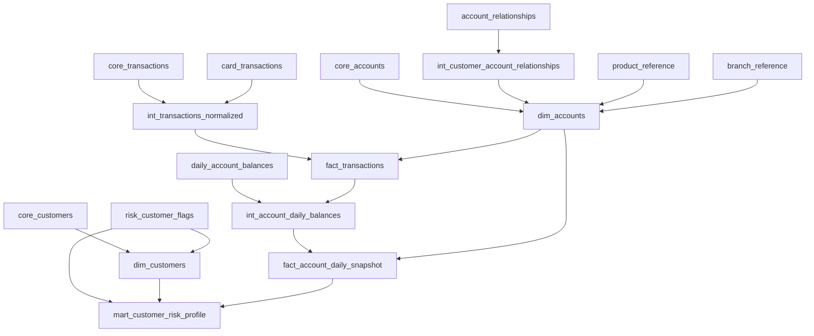
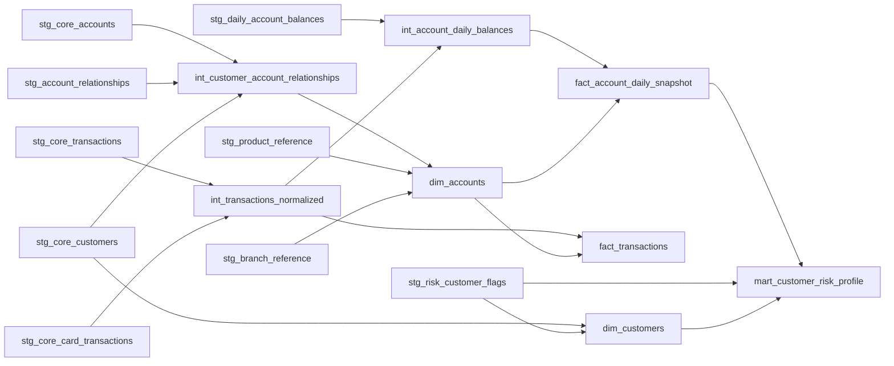

import Tabs from '@theme/Tabs';
import TabItem from '@theme/TabItem';

# Southern Cross Bank Demo Pipeline

<Tabs>
  <TabItem value="overview" label="Overview" default>

This DuckDB/dbt package creates governed retail banking analytics models for the fictional Southern Cross Mutual Bank demo estate.

Confirmed context:

| Item | Value |
| --- | --- |
| Warehouse dialect | DuckDB SQL |
| Local database | `data/bank_demo.duckdb` |
| Raw schema | `raw_bank` |
| Reporting timezone | `Australia/Sydney` |
| Sensitive handling | Direct customer PII is excluded from marts |

Business outputs:

| Model | Grain | Purpose |
| --- | --- | --- |
| `dim_customers` | One row per current source customer | Safe customer attributes, lifecycle status, age band, and active risk summary |
| `dim_accounts` | One row per current source account | Product, branch, ownership summary, account status, and lifecycle dates |
| `fact_transactions` | One row per posted transaction or pending card authorization | Signed transaction analytics, merchant enrichment, pending state, and fraud suspicion markers |
| `fact_account_daily_snapshot` | One row per account per snapshot date | Balance, overdraft, activity, and liquidity reporting |
| `mart_customer_risk_profile` | One row per customer per snapshot date | AML, KYC, sanctions, hardship, vulnerability, and privacy restriction flags |

  </TabItem>
  <TabItem value="pipeline" label="DBT pipeline">

Generated dbt assets:

| Layer | Models |
| --- | --- |
| Staging | `stg_core_customers`, `stg_core_accounts`, `stg_account_relationships`, `stg_core_transactions`, `stg_core_card_transactions`, `stg_daily_account_balances`, `stg_risk_customer_flags`, `stg_branch_reference`, `stg_product_reference` |
| Intermediate | `int_customer_account_relationships`, `int_transactions_normalized`, `int_account_daily_balances` |
| Marts | `dim_customers`, `dim_accounts`, `fact_transactions`, `fact_account_daily_snapshot`, `mart_customer_risk_profile` |

Run locally from the repository root:

```bash
dbt build --project-dir southern_cross_bank_demo_pipeline --profiles-dir southern_cross_bank_demo_pipeline
dbt docs generate --project-dir southern_cross_bank_demo_pipeline --profiles-dir southern_cross_bank_demo_pipeline
```

Use `DUCKDB_PATH` to point at a different DuckDB file:

```bash
DUCKDB_PATH=/path/to/bank_demo.duckdb dbt build --project-dir southern_cross_bank_demo_pipeline --profiles-dir southern_cross_bank_demo_pipeline
```

  </TabItem>
  <TabItem value="definition" label="Data definition">

## Privacy-Safe Customer Dimension

`dim_customers` exposes `customer_id`, `customer_type`, derived `age_band`, tax residency, residency status, lifecycle status, privacy opt-out, active risk summary booleans, and lifecycle timestamps. It does not expose customer names, email addresses, phone numbers, business names, or raw date of birth.

## Account Dimension

`dim_accounts` exposes account identifiers, primary customer id, relationship type summary, product attributes, branch attributes, account status, currency, and lifecycle timestamps. BSB and account number fields are not promoted to the mart.

## Transaction Fact

`fact_transactions` normalizes core and card transactions into a single signed amount structure. Core transaction ids are prefixed with `ACCT-`; card transaction ids are prefixed with `CARD-`. Card merchant fields are populated only for card source rows.

## Daily Account Snapshot

`fact_account_daily_snapshot` uses `daily_account_balances` as the authoritative balance source and enriches each account-date row with posted transaction count, net posted transaction amount, overdraft indicators, account status, account type, and product family.

## Customer Risk Profile

`mart_customer_risk_profile` exposes only boolean risk and care flags. Operational case identifiers and flag case details remain in staging and are not promoted to marts.

  </TabItem>
  <TabItem value="mapping" label="Source-to-target mappings">

The full source-to-target mapping is generated at `mappings/source_to_target.md`.

High-value mappings:

| Target | Source | Logic |
| --- | --- | --- |
| `dim_customers.age_band` | `core_customers.date_of_birth` | Derive completed-age band at `current_date`; do not expose raw date of birth |
| `dim_accounts.account_holder_type_summary` | `account_relationships.relationship_type` | Aggregate active relationship types by account |
| `fact_transactions.transaction_id` | `core_transactions.transaction_id`, `card_transactions.card_transaction_id` | Prefix with `ACCT-` or `CARD-` |
| `fact_transactions.signed_amount` | Core amount and card settlement or authorization amount | Debit-negative and credit-positive according to source rules |
| `fact_account_daily_snapshot.net_transaction_amount` | `fact_transactions.signed_amount` | Sum posted, non-pending transactions by account and snapshot date |
| `mart_customer_risk_profile.aml_review_required` | `risk_customer_flags.flag_type` | True when active `AML_REVIEW` is effective on the snapshot date |

  </TabItem>
  <TabItem value="design" label="Design document">

The full design document is generated at `design/design_document.md`.

Key decisions:

- DuckDB SQL is used because the current source estate is loaded in DuckDB and the demo acceptance criteria call for DuckDB.
- Staging models normalize source types and timestamps but keep the transformation logic reviewable.
- Direct customer PII is excluded from marts.
- Pending card authorizations are retained only because the business rules specify pending handling.
- Risk flags are represented as booleans in marts.
- Source freshness expectations are documented in `models/sources.yml`.

Known limitations:

- Currency conversion is out of scope.
- Risk flags are simplified demo booleans and do not represent a production case workflow.
- `current_date` drives current age bands and active risk flags; historical reproducibility would need an explicit reporting date parameter.

  </TabItem>
  <TabItem value="diagrams" label="Mermaid diagrams">

## Pipeline Flow



## Source-To-Target Lineage



## Model Dependencies



  </TabItem>
  <TabItem value="assumptions" label="Assumptions and open questions">

Assumptions:

- DuckDB is the target SQL dialect.
- The raw schema is `raw_bank`.
- The package is generated as a standalone dbt project.
- Risk profile snapshot dates align to the available account balance snapshot dates.
- The local DuckDB file exists at `../data/bank_demo.duckdb` relative to this package, or `DUCKDB_PATH` is set.

Open questions:

- Whether the consuming documentation site is Docusaurus and already supports Mermaid.
- Whether production-style runs should parameterize reporting date rather than relying on `current_date`.
- Whether pending card authorizations should remain in `fact_transactions` or be split into a separate operational fact in a later iteration.

Validation notes:

- Static package validation was run with the bundled skill validator.
- `dbt build` was not run locally because `dbt` was not installed during generation.

  </TabItem>
</Tabs>
